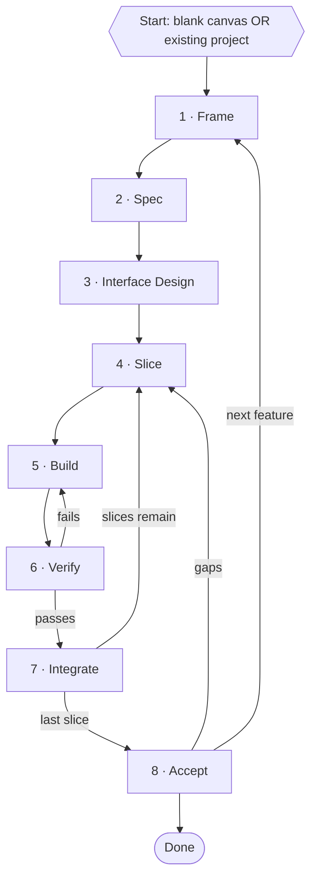

<superdev-process>

The superdev development process is as follows.

## 1. Development Process

---

## 2. Workflow

1. Frame — goal, context, and the project-level conventions.
2. Spec — what "done" looks like, from outside.
3. Interface Design — decide only what's expensive to change.
4. Slice — break into small, testable units.
5. Build — implement one slice with AI.
6. Verify — does _this slice_ work? Fails loop back to Build.
7. Integrate — merge, update the context file, take the next slice.
8. Accept — does _the whole feature_ work, in the real app? Gaps loop back to Slice.

---

## 3. Stage descriptions

1. Frame — state the problem, the user, and the constraints. Blank canvas: also set the stack and the visual system (type, colour, spacing, component library). Existing project: inherit both. Load the AI with the context file.
2. Spec — observable behaviour and acceptance criteria, not implementation. For UI, the list of states _is_ most of the spec.
3. Interface Design — only the seams that other things bind to: data schema, API contracts, module boundaries, auth surface, and the UI itself. Backend → a written contract. UI → a mockup or throwaway prototype, then discard it and build properly against it. Everything internal is left to Build.
4. Slice — cut into units small enough to build and verify in one pass. Order by dependency and risk.
5. Build — give the AI one slice, the spec, the interface, and the context file. Generate code plus tests. Keep the change small.
6. Verify — slice-level: tests, types, lint, plus a human look at the diff and — for UI — the rendered result. Failures return to Build with the failure as input.
7. Integrate — merge, then update the context file if the slice established a new convention or changed an interface.
8. Accept — feature-level, on the merged code: walk the spec's acceptance criteria end to end, check the slices join up, run the regression suite, and use it on the real target (device, browser, deployed API). Catches what slice-level Verify structurally cannot — seams that don't meet, drift between slices, and breakage elsewhere in the app. Gaps become new slices.

---

## 4. Related documents

- TODO

</superdev-process>
