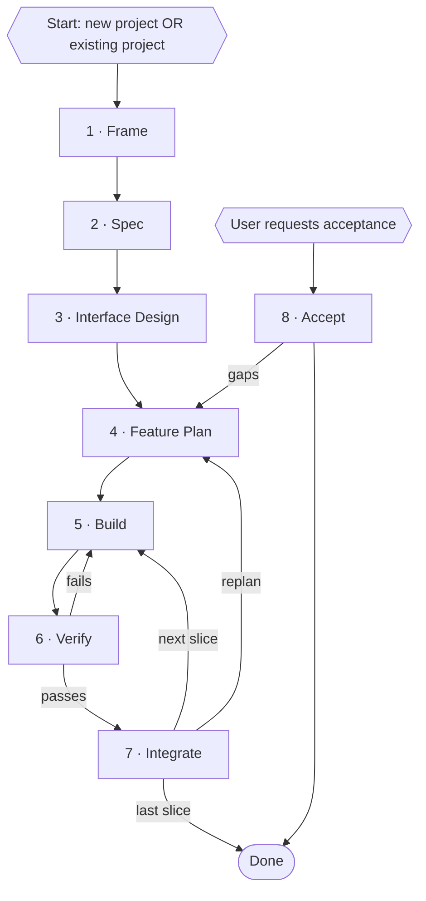

<superdev-process>

The superdev development process is as follows.

## 1. Development Process

---

## 2. Phases

Each phase is a skill; its checklist is `.claude/skills/<phase>/SKILL.md`.

1. Frame — state the problem, the user, and the constraints. New
   project: also choose the tech stack and the visual system.
2. Spec — observable behaviour, acceptance criteria, and the test
   plan.
3. Interface Design — decide the interfaces that are expensive to
   change; record each decision as an ADR.
4. Feature Plan — cut the spec into slices small enough to build and
   verify in one pass, and assign each test-plan case to a slice; the
   slice list is the feature plan.
5. Build — implement one slice: tests first, then the code that passes
   them, committed.
6. Verify — check the slice, updated onto the merge target, against
   its done-check and the test plan; its assigned test-plan cases must
   exist as tests. Failures return to Build.
7. Integrate — merge the slice; the merged code must build, lint, and
   pass the integration tests and a smoke test; update the changelog,
   the canonical knowledge, and the plan.
8. Accept — at the user's request, once the feature has stopped
   changing: check the whole feature against the acceptance criteria,
   in the project's acceptance environment; check the user
   documentation; file gaps as issues. Gaps return to Feature Plan.

---

## 3. Documents

The process reads and writes the canonical knowledge (`knowledge/`):

- Specs: `knowledge/specs/spec-<nnn>-<feature-slug>.md` — behaviour,
  acceptance criteria, and test plan; tagged `done` at accept.
- Plans: `knowledge/plans/plan-<nnn>-<kind>-<slug>.md` — feature plans (the slice
  list; tagged `done` at the last integrate) and ad-hoc plans (one-off
  work outside the feature workflow).
- Decisions: `knowledge/decisions/adr-<nnn>-<slug>.md` — ADRs; permanent.
- Issues: `knowledge/issues/issue-<nnn>-<kind>-<slug>.md` — gaps and
  tickets; `<kind>` is `bug`, `feature-request` or `chore`.
- Templates: `knowledge/templates/` — the document skeletons the
  phases use.

</superdev-process>
